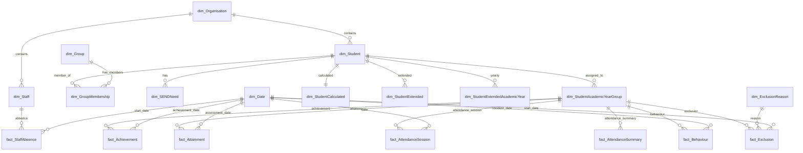

# OEAI Gold Layer ER Diagram (Mermaid)

```mermaid
erDiagram
    dim_Organisation ||--o{ dim_Staff : contains
    dim_Organisation ||--o{ dim_Student : contains

    dim_Student ||--o{ dim_GroupMembership : member_of
    dim_Group ||--o{ dim_GroupMembership : has_members

    dim_Student ||--o{ dim_SENDNeed : has
    dim_Student ||--o{ dim_StudentAcademicYearGroup : assigned_to
    dim_Student ||--|| dim_StudentCalculated : calculated
    dim_Student ||--o{ dim_StudentExtended : extended
    dim_Student ||--o{ dim_StudentExtendedAcademicYear : yearly

    dim_StudentAcademicYearGroup ||--o{ fact_Achievement : achievement
    dim_StudentAcademicYearGroup ||--o{ fact_Attainment : attainment
    dim_StudentAcademicYearGroup ||--o{ fact_AttendanceSession : attendance_session
    dim_StudentAcademicYearGroup ||--o{ fact_AttendanceSummary : attendance_summary
    dim_StudentAcademicYearGroup ||--o{ fact_Behaviour : behaviour
    dim_StudentAcademicYearGroup ||--o{ fact_Exclusion : exclusion

    dim_Staff ||--o{ fact_StaffAbsence : absence
    dim_ExclusionReason ||--o{ fact_Exclusion : reason

    dim_Date ||--o{ fact_Achievement : achievement_date
    dim_Date ||--o{ fact_Attainment : assessment_date
    dim_Date ||--o{ fact_AttendanceSession : date
    dim_Date ||--o{ fact_Behaviour : incident_date
    dim_Date ||--o{ fact_Exclusion : start_date
    dim_Date ||--o{ fact_StaffAbsence : start_date
```
